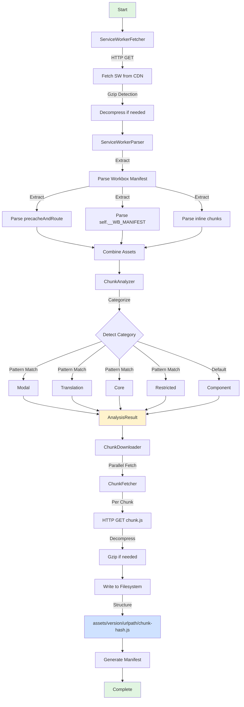

# Service Worker Analyzer

Analyze Perplexity.ai Service Worker configuration, precache manifest, and chunk structure.

## Features

- ✅ Extract Workbox v7.2.0 configuration
- ✅ Parse 1149+ precached assets
- ✅ Categorize chunks (components, modals, translations, core, restricted)
- ✅ Extract CDN domains and cache strategies
- ✅ Auto-detect gzip compression
- ✅ Download and organize chunks to filesystem
- ✅ CLI tool for quick analysis (planned)

## 🔄 Complete Pipeline Workflow



## 📊 Extraction Workflow

The complete workflow for extracting chunks to the filesystem:

### Step 1: Analyze Service Worker

```typescript
import { ServiceWorkerAnalyzer } from 'pplx-unofficial-sdk';

const analyzer = new ServiceWorkerAnalyzer({ version: '104241e' });

// Perform analysis
const result = await analyzer.analyze();

console.log(`✅ Found ${result.meta.totalAssets} assets`);
console.log(`✅ Workbox: v${result.manifest.version}`);
console.log(`✅ Categories:`, Object.fromEntries(result.chunks));
```

**Output:**
```
✅ Found 1149 assets
✅ Workbox: v7.2.0
✅ Categories: {
  component: [ ... 1020 items ],
  modal: [ ... 94 items ],
  translation: [ ... 32 items ],
  core: [ ... 4 items ],
  restricted: [ ... 3 items ]
}
```

### Step 2: Download Chunks

```typescript
import { ChunkDownloader } from 'pplx-unofficial-sdk';

const downloader = new ChunkDownloader({
  outputDir: './assets',
});

// Download all chunks
const downloadResult = await downloader.downloadAll(result, {
  version: '104241e',
  parallel: 10,
  categories: ['component', 'modal', 'translation', 'core'],
});

console.log(`✅ Downloaded: ${downloadResult.downloaded}`);
console.log(`❌ Failed: ${downloadResult.failed}`);
console.log(`⏭️  Skipped: ${downloadResult.skipped}`);
console.log(`📦 Total size: ${(downloadResult.totalSize / 1024 / 1024).toFixed(2)} MB`);
```

**Output:**
```
📦 Downloading 1149 chunks (parallel: 10)...
   Progress: 10/1149 chunks
   Progress: 20/1149 chunks
   ...
   Progress: 1149/1149 chunks

📄 Manifest written to: ./assets/104241e/manifest.json

✅ Downloaded: 1149
❌ Failed: 0
⏭️  Skipped: 0
📦 Total size: 42.56 MB
```

### Step 3: Filesystem Structure

After extraction, chunks are organized as:

```
assets/
└── 104241e/                                    # Version hash
    ├── manifest.json                           # Download metadata
    ├── spa/
    │   └── assets/
    │       ├── Button-BQdpnMAp.js              # Component chunk
    │       ├── Modal-XyZ123.js                 # Modal chunk
    │       ├── en-US.json                      # Translation file
    │       ├── platform-core-ABC456.js         # Core bundle
    │       └── restricted-feature-debug.js     # Restricted feature
    └── root/
        └── other-chunks.js
```

### Step 4: Access Downloaded Chunks

```typescript
import { promises as fs } from 'fs';
import { join } from 'path';

// Read manifest
const manifestPath = './assets/104241e/manifest.json';
const manifest = JSON.parse(await fs.readFile(manifestPath, 'utf-8'));

console.log('Download stats:', manifest.stats);
console.log('Categories:', manifest.categories);

// Access specific chunk
const buttonChunk = manifest.chunks.find(c => c.id.includes('Button'));
if (buttonChunk) {
  const content = await fs.readFile(buttonChunk.path, 'utf-8');
  console.log(`Button chunk size: ${content.length} bytes`);
}
```

## 💻 Complete Example

```typescript
import { 
  ServiceWorkerAnalyzer, 
  ChunkDownloader 
} from 'pplx-unofficial-sdk';

async function extractPerplexityChunks() {
  // 1️⃣ Analyze Service Worker
  console.log('🔍 Analyzing Service Worker...');
  const analyzer = new ServiceWorkerAnalyzer({ version: '104241e' });
  const analysis = await analyzer.analyze();
  
  console.log(`\n📊 Analysis Results:`);
  console.log(`   Total Assets: ${analysis.meta.totalAssets}`);
  console.log(`   Workbox: v${analysis.manifest.version}`);
  console.log(`   File Size: ${(analysis.meta.fileSize / 1024).toFixed(2)} KB`);
  
  // Get statistics by category (reuses same version from constructor)
  const stats = await analyzer.getStats();
  console.log(`\n📈 Category Breakdown:`);
  for (const [category, count] of Object.entries(stats)) {
    console.log(`   ${category}: ${count}`);
  }
  
  // Find specific chunks
  const modals = await analyzer.findChunks(/Modal/);
  console.log(`\n🔎 Found ${modals.length} modal components`);
  
  // 2️⃣ Download chunks
  console.log(`\n⬇️  Downloading chunks...`);
  const downloader = new ChunkDownloader({
    outputDir: './extracted-assets',
  });
  
  const result = await downloader.downloadAll(analysis, {
    version: '104241e',
    parallel: 10,
    categories: ['component', 'modal', 'translation', 'core'],
  });
  
  console.log(`\n✅ Extraction Complete!`);
  console.log(`   Downloaded: ${result.downloaded}`);
  console.log(`   Failed: ${result.failed}`);
  console.log(`   Skipped: ${result.skipped}`);
  console.log(`   Total Size: ${(result.totalSize / 1024 / 1024).toFixed(2)} MB`);
  console.log(`   Output: ${result.outputDir}/104241e/`);
  
  return result;
}

// Run extraction
extractPerplexityChunks().catch(console.error);
```

**Expected Output:**
```
🔍 Analyzing Service Worker...

📊 Analysis Results:
   Total Assets: 1149
   Workbox: v7.2.0
   File Size: 181.08 KB

📈 Category Breakdown:
   component: 1020
   modal: 94
   translation: 32
   core: 4
   restricted: 3

🔎 Found 94 modal components

⬇️  Downloading chunks...
📦 Downloading 1149 chunks (parallel: 10)...
   Progress: 10/1149 chunks
   Progress: 20/1149 chunks
   ...
   Progress: 1149/1149 chunks

📄 Manifest written to: ./extracted-assets/104241e/manifest.json

✅ Extraction Complete!
   Downloaded: 1149
   Failed: 0
   Skipped: 0
   Total Size: 42.56 MB
   Output: ./extracted-assets/104241e/
```

## Usage

### Programmatic API

```typescript
// Note: This import path will be available in a future release of pplx-unofficial-sdk.
import { ServiceWorkerAnalyzer } from 'pplx-unofficial-sdk';

const analyzer = new ServiceWorkerAnalyzer();

// Full analysis
const result = await analyzer.analyze();
console.log(`Found ${result.meta.totalAssets} assets`);
console.log(`Workbox: v${result.manifest.version}`);

// Get statistics
const stats = await analyzer.getStats();
console.log(stats);
// {
//   component: 1020,
//   modal: 94,
//   translation: 32,
//   core: 4,
//   restricted: 3
// }

// Find specific chunks
const modals = await analyzer.findChunks(/Modal/);
console.log(`Found ${modals.length} modal components`);

// Export to file
const json = await analyzer.export(result);
await writeFile('sw-analysis.json', json);
```

### CLI

> **Note**: CLI command implementation is planned for a future release.

```bash
# Full analysis
pplx sw:analyze

# Statistics only
pplx sw:analyze --stats

# Find chunks
pplx sw:analyze --find "Modal"
pplx sw:analyze --find "i18n"

# Export to file
pplx sw:analyze -o analysis.json
pplx sw:analyze -o report.json --format json

# Specific version
pplx sw:analyze --version 104241e

# Download chunks
pplx sw:download --output ./assets --parallel 10

# Download specific categories
pplx sw:download --categories modal,translation --output ./assets
```

## 📁 API Reference

### ServiceWorkerAnalyzer

Main analysis class.

#### Constructor

```typescript
new ServiceWorkerAnalyzer(options?: AnalyzerOptions)
```

**Options:**
- `userAgent?: string` - Custom User-Agent header
- `version?: string` - Default version hash for all operations

#### Methods

##### `analyze(version?: string): Promise<AnalysisResult>`

Perform complete Service Worker analysis.

**Parameters:**
- `version?: string` - Optional version hash (uses constructor default if not provided)

**Returns:** Complete analysis with metadata, manifest, and categorized chunks

##### `getStats(version?: string): Promise<Record<string, number>>`

Get chunk statistics by category.

**Returns:** Object with category counts

##### `findChunks(pattern: string | RegExp, version?: string): Promise<ChunkInfo[]>`

Find chunks matching a pattern.

**Parameters:**
- `pattern: string | RegExp` - Search pattern
- `version?: string` - Optional version hash

**Returns:** Array of matching chunks

##### `export(result: AnalysisResult, format?: 'json'): Promise<string>`

Export analysis result as JSON.

### ChunkDownloader

Handles chunk downloading and filesystem organization.

#### Constructor

```typescript
new ChunkDownloader(options?: { outputDir?: string; userAgent?: string })
```

**Options:**
- `outputDir?: string` - Base output directory (default: `./assets`)
- `userAgent?: string` - Custom User-Agent header

#### Methods

##### `downloadAll(result: AnalysisResult, options?: DownloadOptions): Promise<DownloadResult>`

Download all chunks from analysis result.

**Options:**
- `version?: string` - Version identifier for directory structure
- `parallel?: number` - Parallel download limit (default: 5)
- `categories?: string[]` - Categories to download (default: all)
- `dryRun?: boolean` - Simulate without downloading (default: false)

**Returns:** Download statistics and metadata

##### `downloadChunksByIds(chunkIds: string[], version: string, dryRun?: boolean): Promise<DownloadResult>`

Download specific chunks by their IDs.

## Output Format

```json
{
  "meta": {
    "timestamp": "2026-01-31T19:30:00.000Z",
    "version": "7.2.0",
    "totalAssets": 1149,
    "fileSize": 185424
  },
  "manifest": {
    "version": "7.2.0",
    "assets": [...],
    "routes": [...],
    "strategies": ["CacheFirst", "NetworkFirst"],
    "cdnDomains": ["pplx-next-static-public.perplexity.ai"]
  },
  "chunks": {
    "component": [...],
    "modal": [...],
    "translation": [...],
    "core": [...],
    "restricted": [...]
  }
}
```

## Chunk Categories

- **component**: UI components (~1020)
- **modal**: Dialog/modal components (~94)
- **translation**: i18n files (~32)
- **core**: Platform bundles (platform-core, spa-shell, bootstrap, pplx-stream)
- **restricted**: Restricted features (debug, health, notes)

## Architecture

```
ServiceWorkerAnalyzer
  ├── ServiceWorkerFetcher    # HTTP fetch + gzip decompress
  ├── ServiceWorkerParser     # Manifest extraction
  └── ChunkAnalyzer           # Asset categorization

ChunkDownloader
  ├── ChunkFetcher            # Individual chunk download
  └── Filesystem Writer       # Organized file output
```

## Implementation Details

### Fetcher
- Auto-detects gzip compression (magic bytes `0x1f 0x8b`)
- Supports versioned SW URLs
- Configurable User-Agent

### Parser
- Multiple extraction strategies:
  1. `precacheAndRoute([...])`
  2. `self.__WB_MANIFEST`
  3. Inline chunk references (minified)
- CDN domain extraction
- Cache strategy detection
- Route parsing

### Chunk Analyzer
- Smart category detection:
  - **Modal**: Contains "Modal" or settings/confirmation patterns
  - **Translation**: `[lang]-[COUNTRY].json` format
  - **Restricted**: `/restricted/` path or `restricted-feature-` prefix
  - **Core**: platform-core, spa-shell, bootstrap, pplx-stream
  - **Component**: Regular UI components

### Chunk Downloader
- Parallel batch processing
- Filesystem organization: `assets/{version}/{urlpath}/{chunkname}-{chunkhash}.js`
- Auto-creates directory structure
- Skips already downloaded files
- Generates download manifest with metadata
- Supports dry-run mode for testing

## Advanced Usage

### Incremental Downloads

```typescript
// Download only new chunks
const existingManifest = JSON.parse(
  await fs.readFile('./assets/104241e/manifest.json', 'utf-8')
);

const existingIds = new Set(existingManifest.chunks.map(c => c.id));
const newChunks = allChunks.filter(c => !existingIds.has(c.id));

await downloader.downloadChunksByIds(
  newChunks.map(c => c.id),
  '104241e'
);
```

### Category-Specific Extraction

```typescript
// Download only modals and translations
const result = await downloader.downloadAll(analysis, {
  version: '104241e',
  categories: ['modal', 'translation'],
  parallel: 20,
});
```

### Dry Run Testing

```typescript
// Test without downloading
const result = await downloader.downloadAll(analysis, {
  version: '104241e',
  dryRun: true,
});

console.log(`Would download ${result.downloaded} chunks`);
console.log(`Total size: ${(result.totalSize / 1024 / 1024).toFixed(2)} MB`);
```

## Error Handling

```typescript
try {
  const analyzer = new ServiceWorkerAnalyzer();
  const result = await analyzer.analyze('104241e');
  
  const downloader = new ChunkDownloader();
  const downloadResult = await downloader.downloadAll(result, {
    version: '104241e',
  });
  
  if (downloadResult.failed > 0) {
    console.warn(`⚠️  ${downloadResult.failed} chunks failed to download`);
  }
} catch (error) {
  if (error.message.includes('404')) {
    console.error('Service Worker version not found');
  } else if (error.message.includes('ENOSPC')) {
    console.error('Not enough disk space');
  } else {
    console.error('Extraction failed:', error);
  }
}
```
